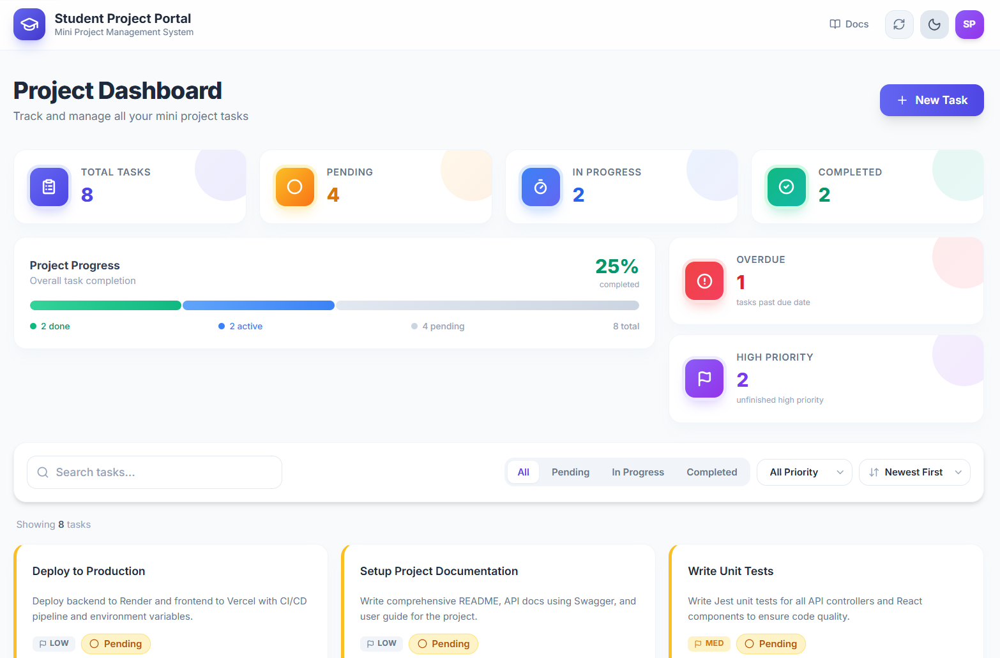

# 🎓 Student Mini Project Management Portal

A full-stack web application for managing student mini projects — built with React, Node.js, Express, and a smart auto-detecting database adapter.


---

 ## 📸 Screenshots




---

## 🛠️ Tech Stack

### Frontend
| Technology | Purpose |
|---|---|
| React + Vite | UI framework & fast dev server |
| Tailwind CSS v3 | Utility-first styling |
| Axios | HTTP client with interceptors |
| React Hot Toast | Toast notifications |
| Context API | Global state (Theme + Tasks) |

### Backend
| Technology | Purpose |
|---|---|
| Node.js + Express | REST API server |
| express-validator | Server-side input validation |
| Mongoose (optional) | MongoDB ORM |
| Sequelize (optional) | MySQL / PostgreSQL ORM |
| In-Memory Adapter | Zero-config fallback (default) |

---

## ✨ Features

- 📋 **Full CRUD** — Create, Read, Update, Delete tasks
- 📊 **Dashboard Stats** — Aggregated project metrics at a glance
- 🔍 **Search & Filter** — Debounced search + sort controls
- 🌙 **Dark Mode** — Persisted via localStorage
- 🔔 **Toast Notifications** — Real-time feedback on every action
- ✅ **Form Validation** — Both client-side and server-side
- 🗃️ **Smart DB Adapter** — Auto-detects MongoDB → MySQL → PostgreSQL → In-Memory
- 📱 **Responsive Design** — Works on desktop and mobile

---

## 📁 Project Structure

```
Student Mini Project Management/
├── client/                        # React + Vite Frontend
│   ├── src/
│   │   ├── components/
│   │   │   ├── TaskCard.jsx
│   │   │   ├── TaskForm.jsx
│   │   │   ├── ConfirmModal.jsx
│   │   │   ├── EmptyState.jsx
│   │   │   ├── LoadingSpinner.jsx
│   │   │   └── Navbar.jsx
│   │   ├── context/
│   │   │   ├── ThemeContext.jsx
│   │   │   └── TaskContext.jsx
│   │   ├── pages/
│   │   │   └── Dashboard.jsx
│   │   ├── api/
│   │   │   └── axiosInstance.js
│   │   └── main.jsx
│   ├── package.json
│   └── vite.config.js
│
└── server/                        # Node.js + Express Backend
    ├── db/
    │   ├── inMemoryAdapter.js
    │   ├── mongooseAdapter.js
    │   └── sequelizeAdapter.js
    ├── middleware/
    │   ├── errorHandler.js
    │   └── validate.js
    ├── routes/
    │   └── taskRoutes.js
    ├── index.js
    └── package.json
```

---

## ⚙️ Getting Started

### Prerequisites
- Node.js v18+
- npm or yarn

### 1. Clone the Repository

```bash
git clone https://github.com/Madhumitha2924/student-project-portall.git
cd student-project-portall
```

### 2. Setup the Backend

```bash
cd server
npm install
npm start
```

> Server runs on `http://localhost:5000`

### 3. Setup the Frontend

```bash
cd client
npm install
npm run dev
```

> Frontend runs on `http://localhost:5173`

---

## 🗄️ Database Configuration

The backend uses a **smart auto-detecting DB adapter**. By default, it uses an **in-memory store** (no setup needed).

To use a real database, create a `.env` file inside the `server/` folder:

```env
# MongoDB
MONGO_URI=mongodb://localhost:27017/student_portal

# OR MySQL
DB_DIALECT=mysql
DB_HOST=localhost
DB_PORT=3306
DB_NAME=student_portal
DB_USER=root
DB_PASS=yourpassword

# OR PostgreSQL
DB_DIALECT=postgres
DB_HOST=localhost
DB_PORT=5432
DB_NAME=student_portal
DB_USER=postgres
DB_PASS=yourpassword
```

> ⚠️ Never commit your `.env` file — it's already in `.gitignore`

---

## 🔌 API Endpoints

Base URL: `http://localhost:5000/api`

| Method | Endpoint | Description |
|---|---|---|
| GET | `/tasks` | Get all tasks |
| GET | `/tasks/:id` | Get a single task |
| POST | `/tasks` | Create a new task |
| PUT | `/tasks/:id` | Update a task |
| DELETE | `/tasks/:id` | Delete a task |
| GET | `/tasks/stats` | Get dashboard statistics |

---

## 🧑‍💻 Author

**Madhumitha**
- B.Tech Computer Science (AI & Data Science)
- Veltech Rangarajan Dr. Sagunthala R&D Institute (2023–2027)
- GitHub: [@Madhumitha2924](https://github.com/Madhumitha2924)

---

## 📄 License

This project is open source and available under the [MIT License](LICENSE).

---
